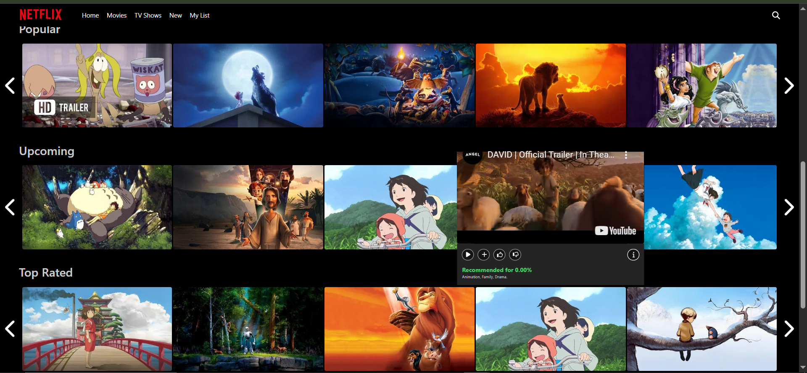
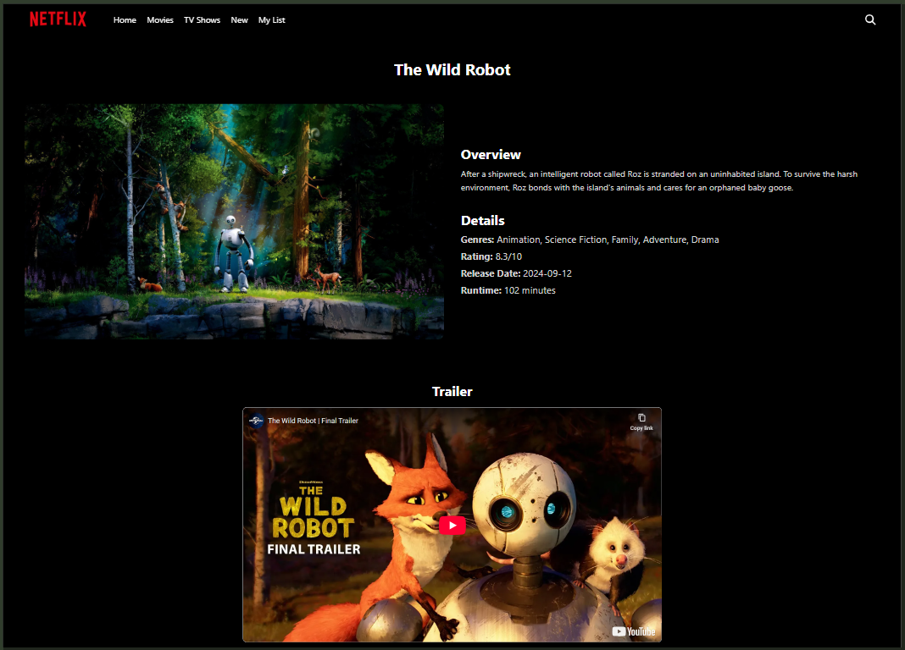
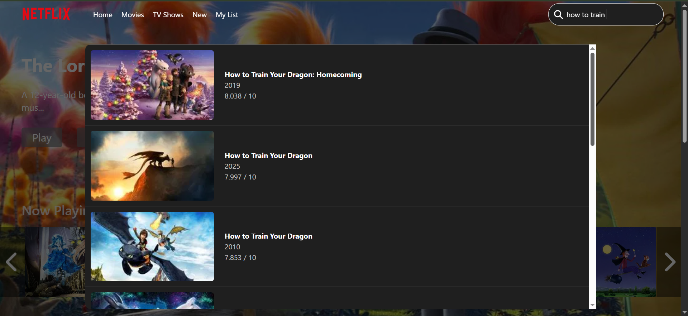
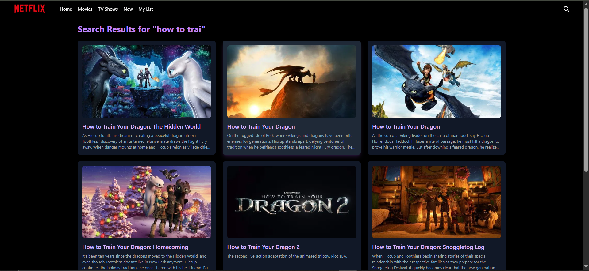

# 🎬 Movie Discovery Platform

A Netflix-inspired movie and TV show discovery application built with React, TypeScript, Tailwind CSS, and the TMDb API.  
The project demonstrates content browsing patterns such as infinite scrolling, debounced search, and dynamic detail pages, with a strong focus on responsiveness and UI transitions.

[](https://netflix-clone-ts-pi.vercel.app/)
[](https://github.com/OussamaDjebbour/netflix-clone-ts)

 <!-- Add a screenshot here -->

## ✨ Features

### 🎥 Content Discovery

- **Multiple Categories**: Browse Trending, Most Played, Upcoming, and Top Rated content
- **Horizontal Carousels**: Smooth navigation with Swiper.js
- **Detail Pages**: Comprehensive info including title, overview, ratings, trailer, and other details

### 🔍 Search & Navigation

- **Real-time Search**: Debounced search (400ms) for optimal performance
- **Infinite Scroll**: Load content progressively in batches with Tanstack query and React Intersection Observer
- **Smart Caching**: TanStack Query minimizes redundant API requests through caching and request deduplication
- **Responsive Navigation**: Mobile-friendly menu and layout

### 🎨 User Experience

- **Smooth Animations**: Framer Motion for fluid transitions, Trailer autoplay on hover
- **Hero Section**: Dynamic featured content display
- **Loading States**: Skeleton screens while content loads
- **Responsive Design**: Optimized for all screen sizes (320px - 1920px+)

### ⚡ Performance

- **Lazy Loading**: Images and components load on demand
- **Code Splitting**: Optimized bundle size
- **Intersection Observer**: Efficient infinite scroll implementation
- **API Optimization**: Request caching and batching

## 🛠️ Tech Stack

**Frontend Framework**

- React 18
- TypeScript
- Tailwind CSS

**Data Management**

- TanStack Query (React Query)
- Axios (HTTP client)
- React Intersection Observer

**UI & Animations**

- Framer Motion (animations)
- Swiper.js (carousels)
- FontAwesome (icons)
- React Responsive (adaptive layouts)

**API Integration**

- TMDb API (The Movie Database)
- RESTful API patterns

**Dev Tools**

- Vite (build tool)
- ESLint + Prettier
- TypeScript strict mode

## 🚀 Getting Started

### Prerequisites

- Node.js 18+ and npm/pnpm/yarn
- TMDb API key ([Get one here](https://www.themoviedb.org/settings/api))

### Installation

1. Clone the repository

```bash
git clone https://github.com/OussamaDjebbour/netflix-clone-ts.git
cd netflix-clone-ts
```

2. Install dependencies

```bash
npm install
```

3. Create a `.env` file in the root directory

```env
VITE_API_KEY=your_api_key_here
```

4. Start the development server

```bash
npm run dev
```

5. Open [http://localhost:5173](http://localhost:5173)

### Build for Production

```bash
npm run build
```

## 📁 Project Structure

```
src/
├── components/          # Reusable UI components
│   ├── features/       # Homepage-related components
│   └── ui/             # Base and reusable UI components
├── pages/              # Page components
├── context/            # Context Api for managing global states
├── hooks/              # Custom React hooks
├── services/           # API services
├── types/              # TypeScript interfaces
├── helpers/              # Utility(Helpers) functions
└── App.tsx             # Root component
```

## 🎯 Key Features Explained

### Infinite Scroll Implementation

```typescript
// Uses React Intersection Observer + TanStack Query
const { data, fetchNextPage, hasNextPage } = useInfiniteQuery({
  queryKey: ['movies', query],
  queryFn: ({ pageParam = 1 }) => searchAllMoviesAndShows(query, pageParam),
  getNextPageParam: (lastPage) => lastPage.nextPage,
  initialPageParam: 1,
  refetchOnWindowFocus: false,
});
```

### Debounced Search

- 400ms delay prevents excessive API calls
- Lodash debounce for optimization
- Reduces API requests

### Animation Strategy

- Framer Motion for page transitions
- Staggered animations for content loading
- Smooth hover effects on cards

## 🔮 Future Enhancements

- [ ] User authentication
- [ ] Watchlist functionality
- [ ] User ratings and reviews
- [ ] Similar movie recommendations
- [ ] Genre-based filtering

## 📸 Screenshots

### Homepage with one Carousel


### Homepage with the rest of the Carousels



### Homepage (Mobile View)


### Movie Detail Page



### Search Results



### All Search Results



## 🎬 Demo

Visit the live demo: [https://netflix-clone-ts-pi.vercel.app/](https://netflix-clone-ts-pi.vercel.app/)

## 🤝 Contributing

Contributions, issues, and feature requests are welcome!

## 📝 License

This project is open source and available under the [MIT License](LICENSE).

## 👤 Author

**Oussama Djebbour**

- Portfolio: [my-personal-portfolio-ts.netlify.app](https://my-personal-portfolio-ts.netlify.app/)
- GitHub: [@OussamaDjebbour](https://github.com/OussamaDjebbour)
- LinkedIn: [Oussama Djebbour](https://www.linkedin.com/in/oussama-djebbour-87251827a/)

## 🙏 Acknowledgments

- [TMDb API](https://www.themoviedb.org/documentation/api) for movie data
- [Framer Motion](https://www.framer.com/motion/) for animations
- [Swiper.js](https://swiperjs.com/) for carousels
- [Tailwind CSS](https://tailwindcss.com/) for styling

---

⭐ Star this repo if you found it helpful!
